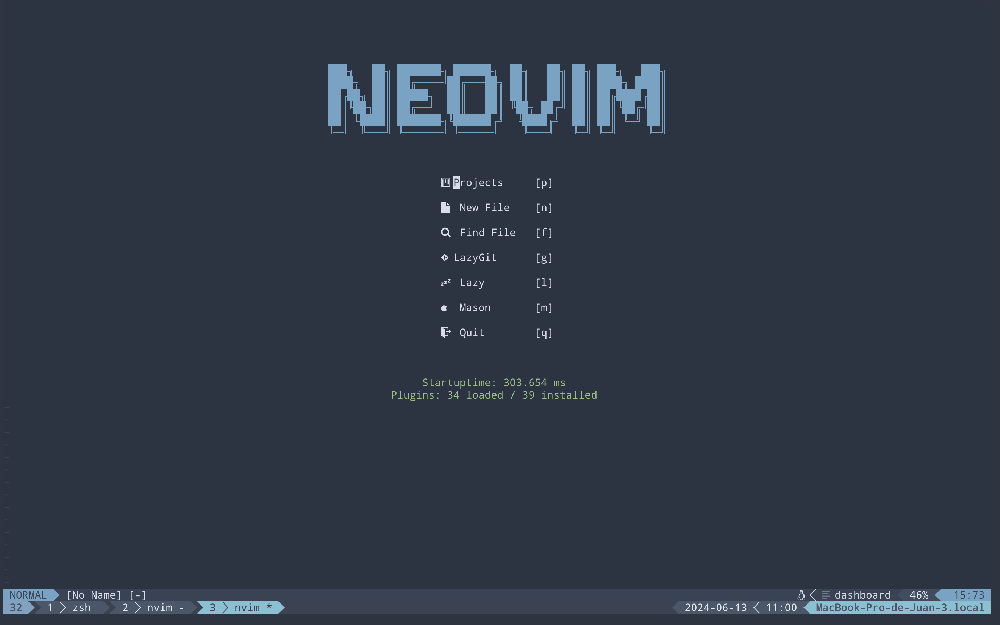
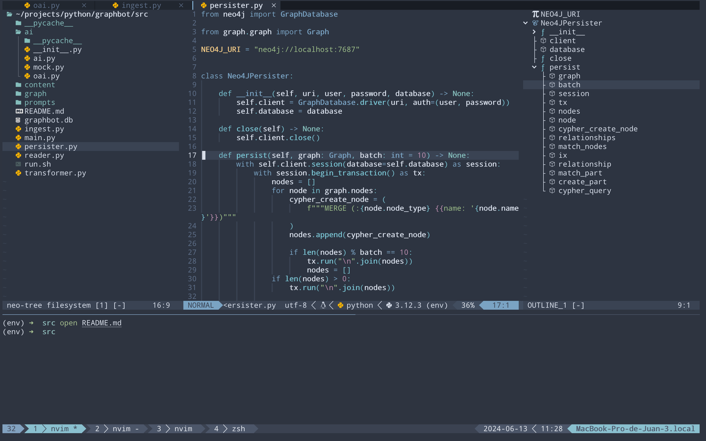
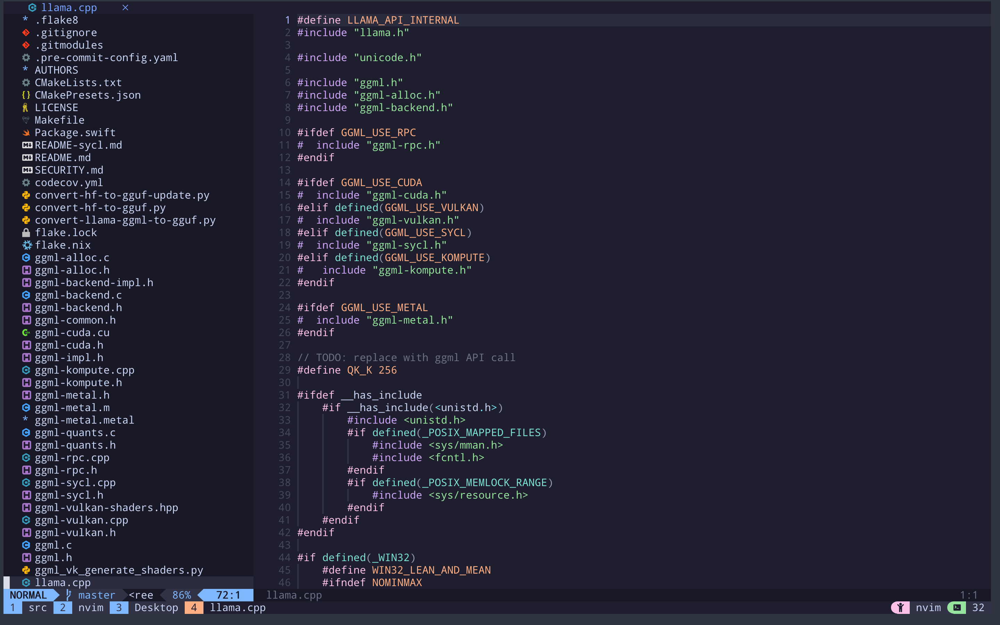
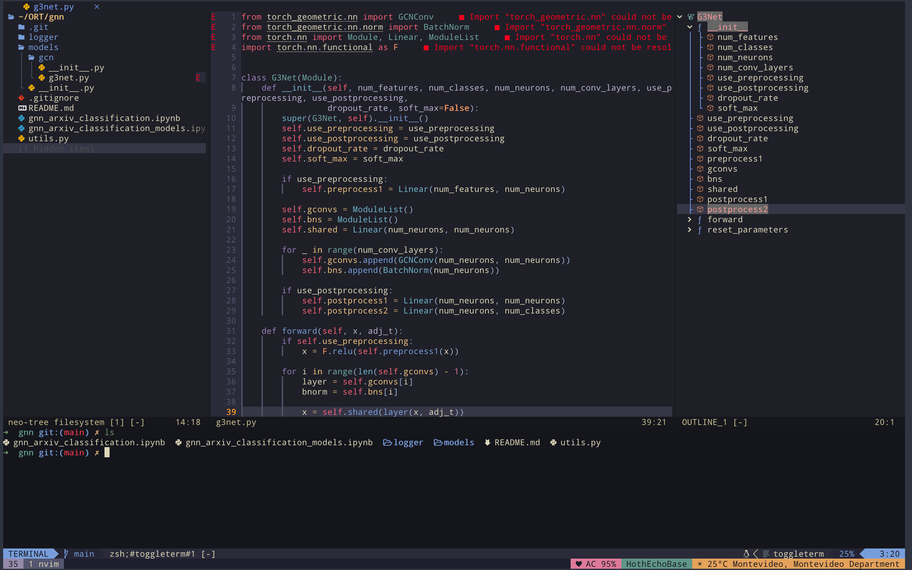
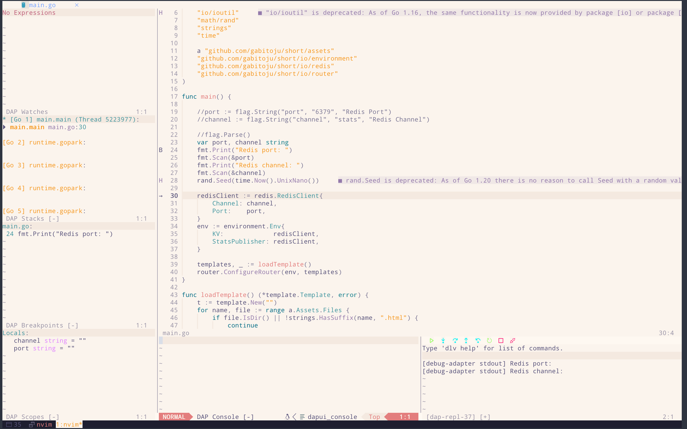
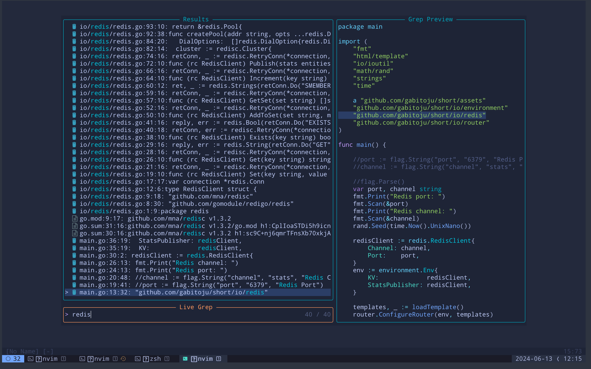

# nvimconfig: yet another neovim configuration

______

## Screenshots

## What is it?

nvimconfig is a curated collection of Neovim plugins and themes aimed at creating a pleasant development experience by transforming Neovim into a full-fledged IDE. It strives to provide a set of sensible defaults while maintaining a beautiful UI and theme.

## What plugins are included?

Among others, the following plugins are included:

 - [lazy.nvim](https://github.com/folke/lazy.nvim)
 - [nvim-treesitter](https://github.com/nvim-treesitter/nvim-treesitter)
 - [Neo-tree.nvim](https://github.com/nvim-neo-tree/neo-tree.nvim)
 - [telescope.nvim](https://github.com/nvim-telescope/telescope.nvim)
 - [lazygit.nvim](https://github.com/kdheepak/lazygit.nvim)
 - [mason.nvim](https://github.com/williamboman/mason.nvim)
 - [nvim-lspconfig](https://github.com/neovim/nvim-lspconfig)
 - [nvim-dap](https://github.com/mfussenegger/nvim-dap)
 - [none-ls.nvim](https://github.com/nvimtools/none-ls.nvim)

## What themes come with nvimconfig?

nvimconfig includes some of the most beautiful themes that are available for Neovim:

 - Catpuccin
 - Kanagawa
 - Nord (this is nvimconfig's default)
 - Rosé Pine
 - Tokyo Night

<section>
Click here for a showcase of this themes

<section>

## Why?

You might we wondering why another Neovim configuration repo? Well, if you are here you must love programming as much as I do. Just to write code for the sake of it. Tweak your environment in order to say, cool, this is mine, I feel comfortable here and I'm going to slam my keyboard just writing some kick ass code. 

There are a lot of great configs out there but I want to make one that feel my own and share it with everyone. That's why this project exists.

Or, maybe, just because 🙂.

## Thanks

I would like to thanks all the people that and the communities that have built all this awesome tools, from Neovim to each of the plugins and themes used in this project. And to all those creators that have invest hours in creating amazing tutorials on how to use Neovim and how to personalize it. You all rock.

    From Uruguay 🇺 with ❤️ 

